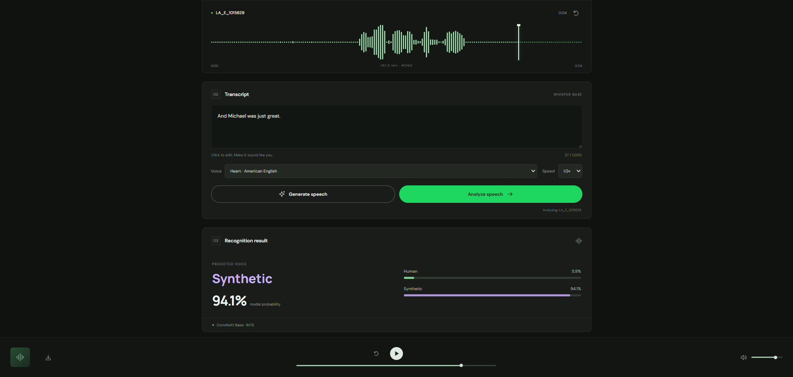
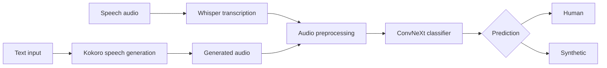

<div align="center">

# Synthetic Speech Recognizer

### Identify human and synthetic speech from audio

Record, upload, or generate speech, then classify it with a ConvNeXt V2 audio model.

<a href="#1-project-overview">Overview</a> ·
<a href="#2-tech-stack">Tech stack</a> ·
<a href="#3-ai-workflow">Workflow</a> ·
<a href="#4-dataset">Dataset</a> ·
<a href="#5-install-and-run">Installation</a>

</div>

<br>

<p align="center">
  
</p>

<br>

## 1. Project Overview

Synthetic Speech Recognizer is a web application for recording, uploading, generating, and analyzing speech. It predicts whether an audio clip is **Human** or **Synthetic**.

The application supports two ways to start:

- Record or upload speech, transcribe it with Whisper, then analyze the audio.
- Enter text, generate speech with Kokoro, then analyze the generated audio.

The classifier uses a ConvNeXt Base INT8 ONNX model. Audio is processed locally by the FastAPI application; recordings and transcripts are not stored by the server.

> [!TIP]
> Model source: [ConvNeXt V2 Synthetic Speech Recognizer on Hugging Face](https://huggingface.co/vuog23/ConvNeXt_V2_Synthetic_Speech_Recognizer)

## 2. Tech Stack

<p align="center">
  
  
  
  
  
  
  
  
</p>

<p align="center">
  
  
  
</p>

## 3. AI Workflow



> [!NOTE]
> Whisper provides a transcript for recorded or uploaded speech. The final Human/Synthetic prediction is based on the audio signal, not the transcript.

## 4. Dataset

The training dataset combines the following sources:

| Source | Purpose |
| --- | --- |
| **ASVspoof 2019** | Genuine and spoofed speech samples |
| **LibriSpeech train-clean-100** | Genuine human speech samples |

The combined dataset is organized into `train`, `validation`, and `test` splits with two classes:

- `real` / Human
- `fake` / Synthetic

The classifier is trained to distinguish real human recordings from synthesized or spoofed speech.

> [!TIP]
> Dataset source: [ASVspoof + LibriSpeech on Kaggle](https://www.kaggle.com/datasets/trieuvuongnguyen/asvspoof-librispeech/settings)

## 5. Install and Run

### Requirements

- Python 3.11
- Internet access for the first model download
- A local ONNX classifier at `models/convnext_base/best_model_int8.onnx`

### Windows PowerShell

From the project root:

```powershell
python -m venv .venv
.\.venv\Scripts\python.exe -m pip install -r requirements.txt
.\.venv\Scripts\python.exe run.py
```

Open [http://localhost:3000](http://localhost:3000) in Chrome or Edge. Allow microphone access if you want to record audio.

> [!IMPORTANT]
> The first transcription or text-to-speech request downloads the required model files. Keep the terminal open while using the application.

To run the application again after installation:

```powershell
.\.venv\Scripts\python.exe run.py
```

Set a different port when needed:

```powershell
$env:PORT = 8000
.\.venv\Scripts\python.exe run.py
```

API documentation is available at [http://localhost:3000/docs](http://localhost:3000/docs).
